# A freelance project developed by Prathamesh More and Amit Gujar for computer tuition organization.

## Demo

https://spark-classes-app.herokuapp.com/

Admin:

Email : admin@test.com
Password : test

Student : 
Email : Any registerated student
Password : sparkclasses

## Technical Details

Total lines of code : 91 files, 7803 codes, 218 comments, 950 blanks, all 8971 lines

Frontend by [Amit Gujar](http://github.com/AmitGujar)

Backend By [Prathamesh More](http://github.com/pprathameshmore)

### Frontend: It is sever side rendered pages

HTML5, CSS3, JavaScript - Primary

#### Other libs:

JQuery, Bootstrap, SweetAlert2, Moment.js

#### Font scripts:

Font Awesome, Google Font API

### Backend:

#### Programming language

Node.js

#### Framework:

Express.js

#### Web server:

Express.js

#### Database:

MongoDB

#### Cache:

Redis

#### CDN: (Thinking to add)

Cloudflare

### Features:

#### Admin:

* Admin can add new admissions.
* Manage admissions, sort by date, or alphabets.
* Update existing admission easily.
* Print fee receipt, installments in PDF.
* View detailed information of a student.
* Add new courses.
* Manage courses.
* Create a question bank for courses.
* Create exams for courses.
* An exam can be created using adding manual questions or picking random questions
  from a question bank of that subject.
* Each question bank consists of a particular topic of that subject.
* Get questions by topic.
* Questions details can be updated or changed to other topics of that subject or
  removed easily with clean card-based UI.
* Manage exams like updating, removing.
* See the results for a particular exam of the subject.
* See scored marks by the student for a particular student.
* Each student gets a randomized question list.
* Handle user enquires.
* Mobile-friendly responsive UI.

#### Student

* Students can see question banks for exam practice.
* Students can be an attempt to practice exam which is MCQ based.

### Security:

* All passwords are hashed.
* Every sensitive information like phone number, address, etc. of student encrypted using a 32-bit asymmetric key and stored in the database.
* Every critical and sensitive information taking forms are protected against Cross-site Request Forgery (CSRF) attack.

### Screenshots:

#### Mobile:

Homepage | Student Signing | Student Dashboard 
------------ | ------------- | ---------------
| 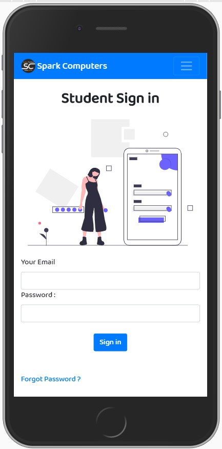 | 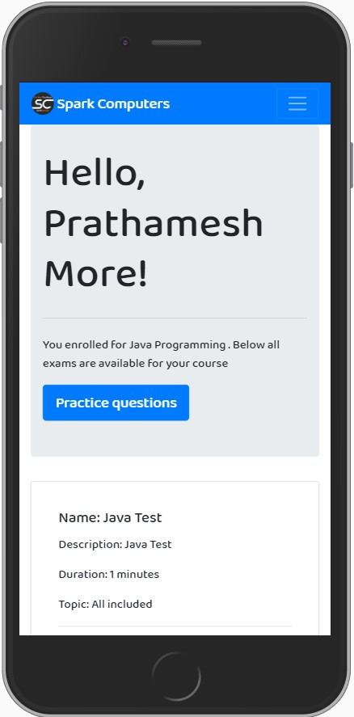

Courses | Live Exam | Student Practice Questions 
------------ | ------------- | ---------------
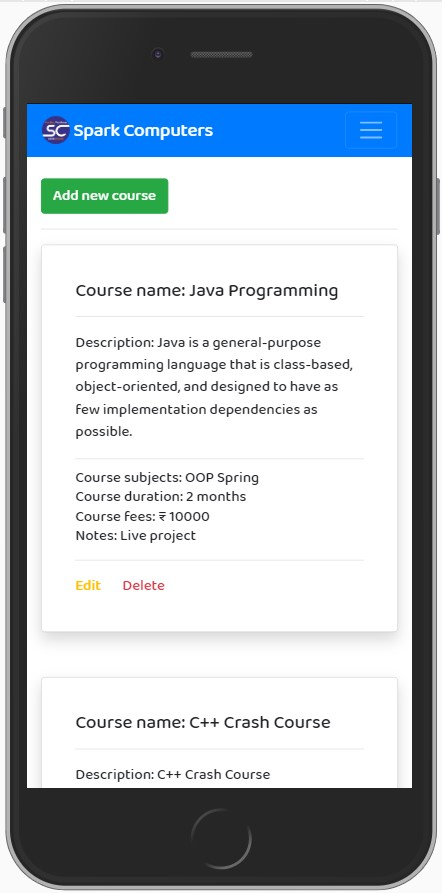| 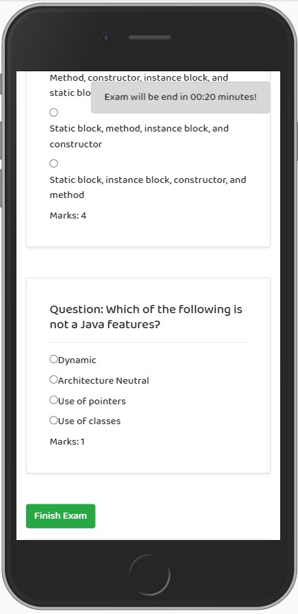 | 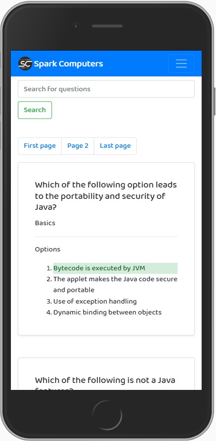

Admin Dashboard | All admission | Student Details
------------ | ------------- | ---------------
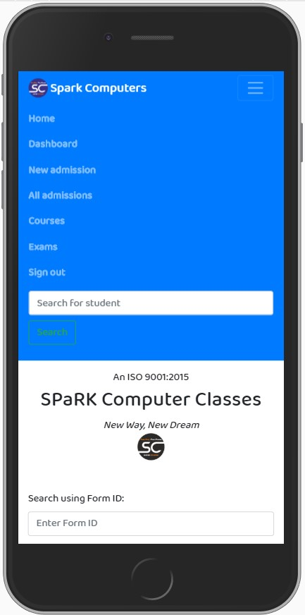| 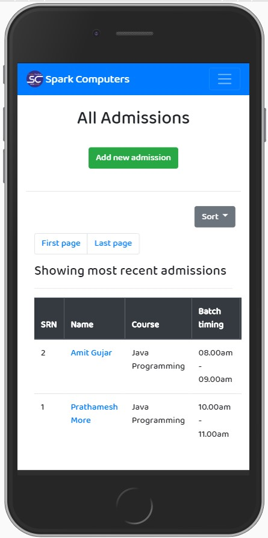 | 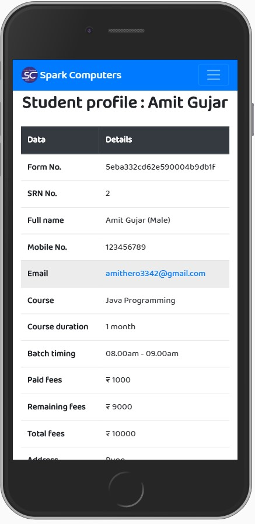

Fees Update and Print | New Admission | Exams for Courses
------------ | ------------- | ---------------
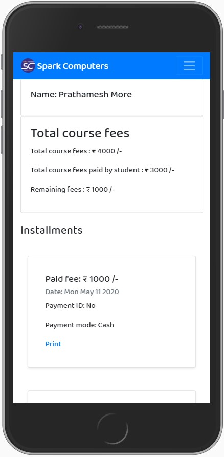| 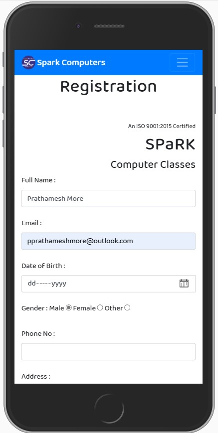 | 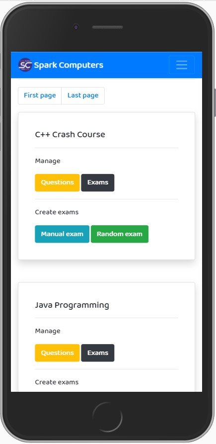

Course Question Bank | Exams | Results
------------ | ------------- | ---------------
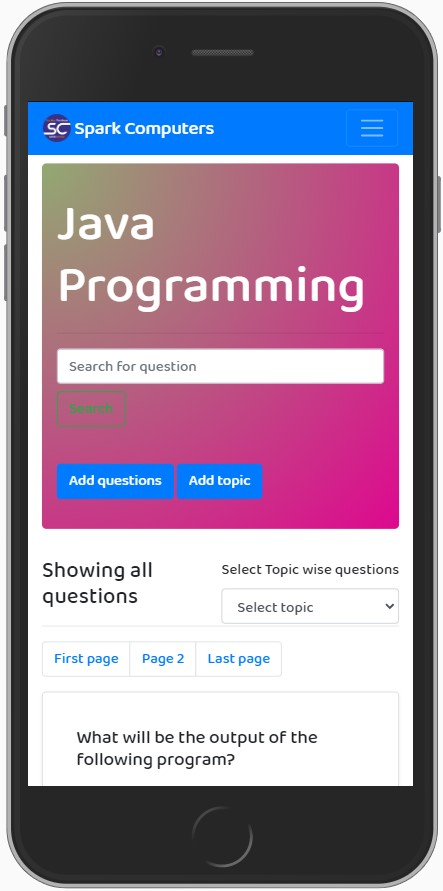| 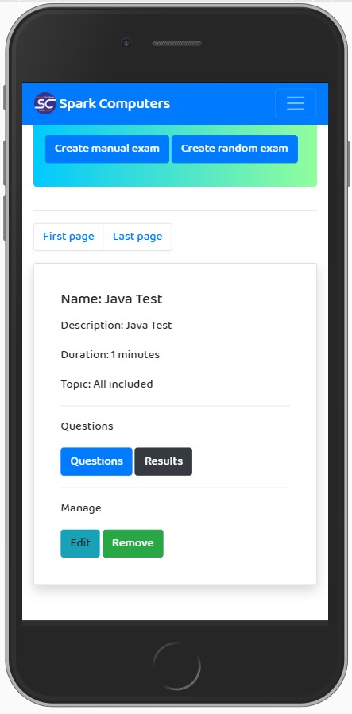 | 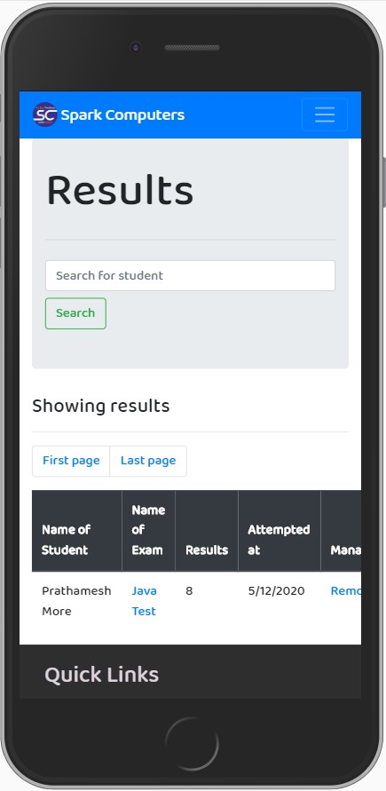

#### Desktop:

| Admin Dashboard                                               | Student Details                                               |
| ------------------------------------------------------------- | ------------------------------------------------------------- |
| 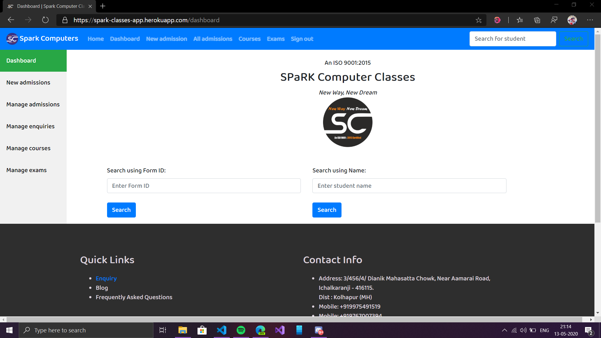 | 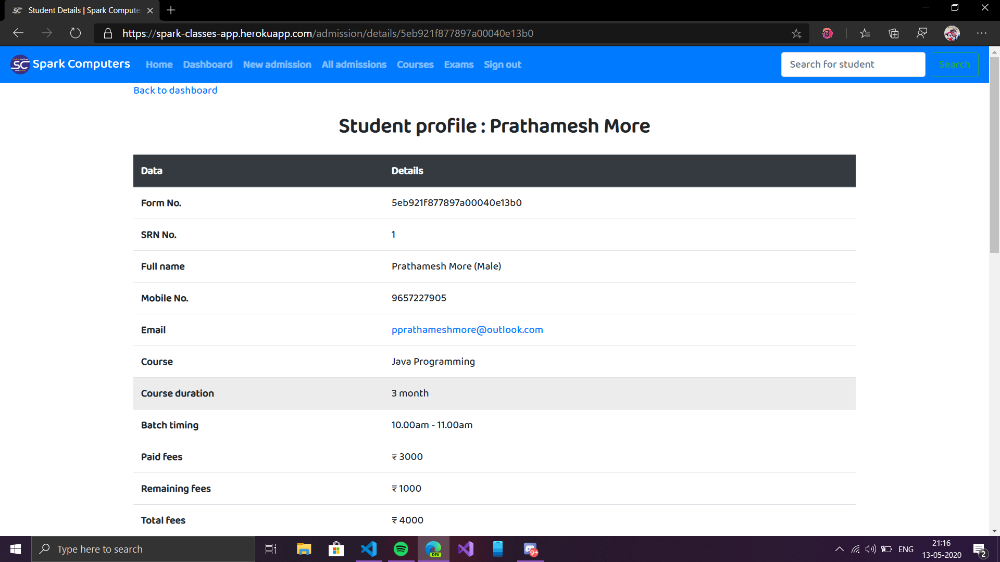 |

| Student Login                                               | Fees Info                                         |
| ----------------------------------------------------------- | ------------------------------------------------- |
| 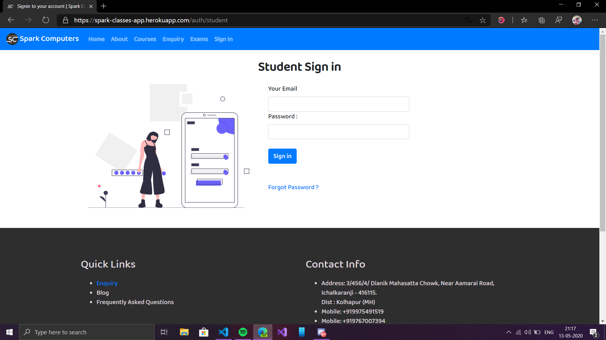 | 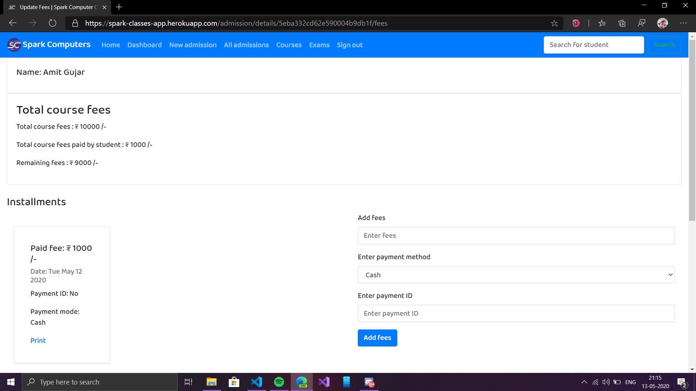 |

| Courses                                       | Exams Info                                     |
| --------------------------------------------- | ---------------------------------------------- |
| 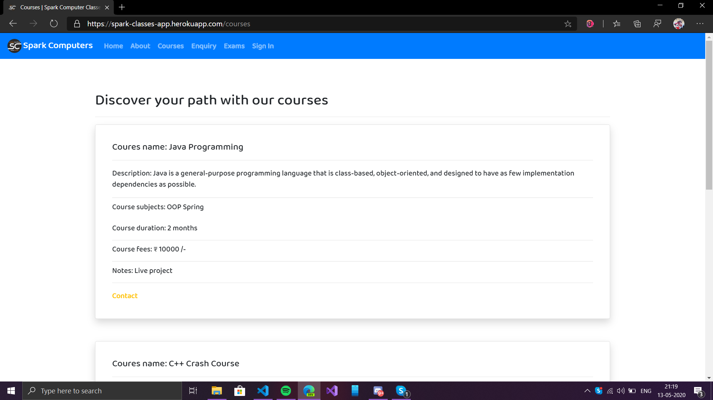 | 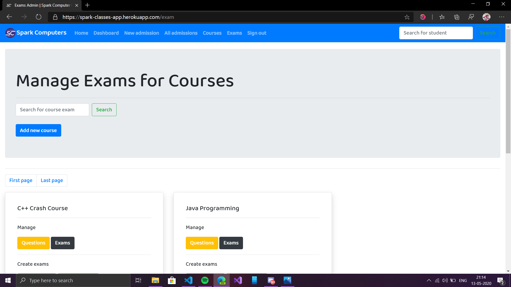 |
